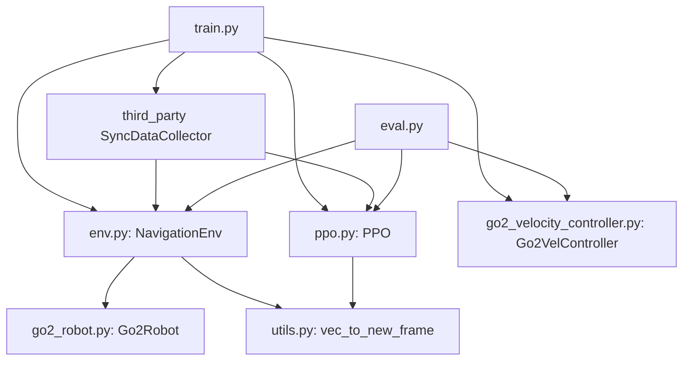
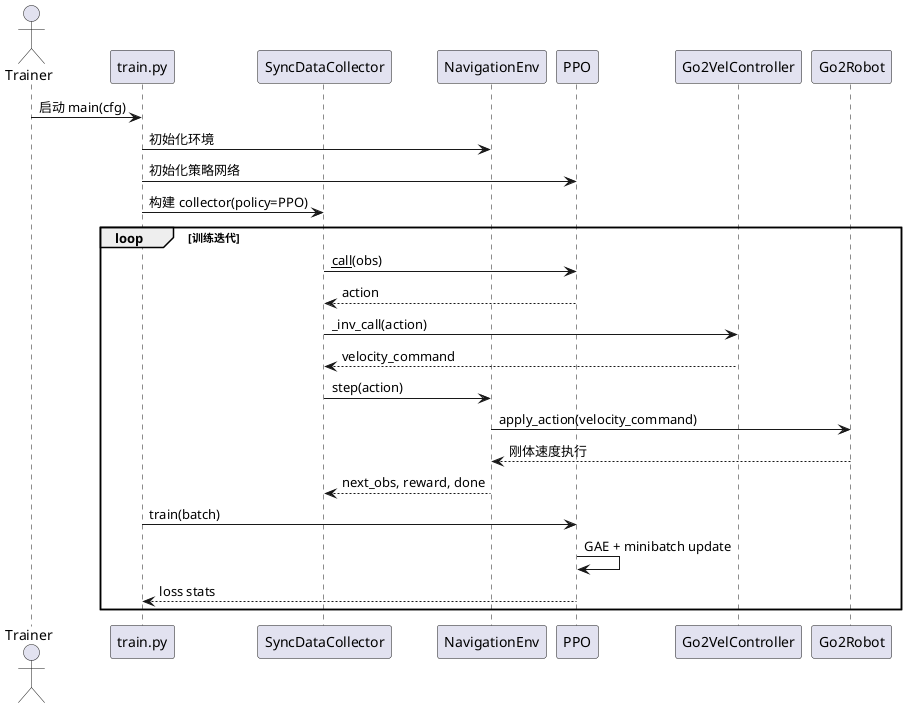

# 简化刚体强化学习系统分析与审计报告

## 1. 项目空间全景分析

### 1.1 scripts 目录结构

```text
isaac-training/training/scripts/
├── env.py
├── eval.py
├── go2_robot.py
├── go2_velocity_controller.py
├── ppo.py
├── train.py
├── utils.py
├── utils_annotated.py
├── reward_tuning_template.py
└── tests/
    └── test_go2_velocity_controller.py
```

### 1.2 模块调用拓扑图



### 1.3 配置项总表（状态/奖励/动作/速度控制）

| 类别 | 配置项 | 默认值 | 来源 | 作用 |
|---|---|---:|---|---|
| 状态 | `algo.feature_extractor.dyn_obs_num` | `5` | `cfg/ppo.yaml` | 动态障碍物观测数量 |
| 状态 | `sensor.lidar_range` | `4.0` | `cfg/go2.yaml` | LiDAR 探测半径 |
| 状态 | `sensor.lidar_vfov` | `[0, 20]` | `cfg/go2.yaml` | LiDAR 垂直视场 |
| 状态 | `sensor.lidar_vbeams` | `3` | `cfg/go2.yaml` | LiDAR 垂直束数 |
| 状态 | `sensor.lidar_hres` | `10.0` | `cfg/go2.yaml` | 水平角分辨率（36 束） |
| 奖励 | `collision_penalty` | `-200` | `env.py` 常量 | 碰撞强惩罚 |
| 奖励 | `goal_reward` | `+200` | `env.py` 常量 | 到达目标奖励 |
| 奖励 | `progress_scale` | `10.0` | `env.py` 常量 | 距离改进奖励系数 |
| 奖励 | `velocity_scale` | `2.0` | `env.py` 常量 | 前进速度奖励系数 |
| 奖励 | `static_safety_scale` | `2.0` | `env.py` 常量 | 静态障碍惩罚强度 |
| 奖励 | `dynamic_safety_scale` | `3.0` | `env.py` 常量 | 动态障碍惩罚强度 |
| 奖励 | `heading_scale` | `0.5` | `env.py` 常量 | 朝向目标奖励系数 |
| 动作 | `algo.actor.action_limit` | `2.0` | `cfg/ppo.yaml` | PPO 输出缩放上限 |
| 动作 | `go2.action_spec.shape` | `(3,)` | `go2_robot.py` | `(vx, vy, vyaw)` |
| 速度 | `Go2Robot.max_linear_vel` | `2.5` | `go2_robot.py` | 线速度硬限幅 |
| 速度 | `Go2Robot.max_angular_vel` | `1.57` | `go2_robot.py` | 角速度硬限幅 |
| 速度 | `Go2Robot.max_linear_acc` | `6.0` | `go2_robot.py` | 线加速度限幅 |
| 速度 | `Go2Robot.max_angular_acc` | `8.0` | `go2_robot.py` | 角加速度限幅 |
| 速度 | `Go2VelocityController.smoothing_alpha` | `0.3` | `go2_velocity_controller.py` | 速度平滑系数 |

## 2. 训练全流程逆向梳理

### 2.1 时序图（PlantUML）



### 2.2 数据流闭环

`仿真环境 -> 状态提取 -> 奖励计算 -> 策略网络 -> 速度指令 -> 刚体执行 -> 下一帧状态`

- 状态提取：`env.py::_compute_state_and_obs`
- 奖励计算：`env.py::_compute_state_and_obs`（内部同步计算）
- 策略网络：`ppo.py::__call__`
- 速度指令：`go2_velocity_controller.py`
- 刚体执行：`go2_robot.py::apply_action`

### 2.3 可复现关键参数与路径

| 项目 | 值/规则 | 来源 |
|---|---|---|
| 训练随机种子 | `seed=42` | `cfg/train.yaml` |
| 环境设置种子 | `transformed_env.set_seed(cfg.seed)` | `train.py`, `eval.py` |
| 地形生成种子 | `seed=0` | `env.py` |
| 训练批次 | `frames_per_batch = num_envs * training_frame_num` | `train.py` |
| PPO 训练轮次 | `training_epoch_num=4` | `cfg/ppo.yaml` |
| mini-batch 数 | `num_minibatches=16` | `cfg/ppo.yaml` |
| checkpoint 路径 | `run.dir/checkpoint_{i}.pt` 与 `checkpoint_final.pt` | `train.py` |
| TensorBoard 路径 | `run.dir/tensorboard` | `train.py` |
| WandB 路径 | `run.dir`（offline/online） | `train.py` |

## 3. 状态空间定义审计

### 3.1 当前状态拼接逻辑

`state(8) = [rpos_norm_xy(2), distance_xy(1), vel_xy(2), yaw(1), target_relative_yaw(1), yaw_rate(1)]`

### 3.2 维度一致性

- `observation_spec["state"] = 8` 与代码拼接一致
- `lidar = [1, 36, 3]` 与配置一致
- `dynamic_obstacle = [1, N, 10]` 与拼接一致

### 3.3 风险与清理结果

- 已加 `nan_to_num`：`lidar_scan`、`robot_state`、`direction`、`dynamic_obstacle`
- 动态障碍方向归一化已加 `clamp_min(1e-6)` 防零除
- 仍建议后续将 `direction` 做单位化，并把不同量纲做统一标准化

### 3.4 状态空间变更日志

| 字段名 | 旧维度 | 新维度 | 归一化方式 | 备注 |
|---|---:|---:|---|---|
| `state` | 13 | 8 | 方向向量归一化 + 角度包裹到 `[-pi, pi]` | 从全状态压缩到导航关键状态 |
| `rpos` | 3 | 2 | `rpos_xy / ||rpos_xy||` | 去掉 z 轴 |
| `vel` | 3 | 2 | 坐标变换后保留 xy | 去掉 z 速度 |
| `ang_vel` | 3 | 1 | 仅取 `wz` | 只保留 yaw 角速度 |

## 4. 奖励函数设定审计

### 4.1 奖励分量与权重

| 分量 | 公式摘要 | 当前系数 |
|---|---|---:|
| 进度奖励 | `(prev_distance - distance) * 10` | `1.0` |
| 速度奖励 | `forward_vel * clamp(cos(angle),0,1) * 2` | `1.0` |
| 静态安全 | `-exp(-d/0.5)*2` | `1.0` |
| 动态安全 | `-sqrt(lidar_range-d)*3` | `1.0` |
| 角速度惩罚 | `-abs(yaw_rate)*0.5` | `1.0` |
| 碰撞惩罚 | `-200` | 固定 |
| 到达奖励 | `+200` | 固定 |
| 朝向奖励 | `cos(relative_angle)*0.5` | `1.0` |

### 4.2 梯度敏感性（样本点）

样本点：`distance=2.8, forward_vel=1.2, target_front=0.8, min_lidar=1.0, dyn_dist=1.5, yaw_rate=0.4, angle=0.3`

| 变量 | dReward/dVariable |
|---|---:|
| distance | `-10.000000` |
| forward_vel | `+1.600000` |
| target_front | `+2.400000` |
| min_lidar_dist | `+0.541341` |
| dyn_dist | `+0.948683` |
| yaw_rate | `-0.500000` |
| relative_angle | `-0.147760` |

### 4.3 冲突项

- 速度奖励与静/动态安全惩罚冲突：狭窄区域前进会被显著惩罚
- 进度奖励与角速度惩罚冲突：转向绕障时 `yaw_rate` 惩罚抑制脱困

### 4.4 调优模板

- 已新增 `training/scripts/reward_tuning_template.py`
- 支持输出 JSONL 参数网格，用于批量 sweep

## 5. 动作空间与速度控制审计

### 5.1 执行链路结论

`ppo(action_limit) -> Go2VelocityController(映射+平滑+限幅+急停) -> Go2Robot(限幅+加速度限幅+急停) -> 刚体执行`

### 5.2 关键修复

- 修复动作缩放链路，避免重复归一化引入的比例漂移
- 增加速度平滑（EMA）
- 增加急停逻辑（输入掩码触发置零）
- 增加线加速度/角加速度限幅
- 明确该链路是简化刚体速度执行，不是关节 PID 闭环

## 6. 代码质量优化与统计

### 6.1 已完成项

- 清理重复模块级文档、部分无效调试输出
- 删除 `ppo.py` 未使用导入
- 修正 `ppo.py` 中 critic 学习率绑定错误（改用 `cfg.critic.learning_rate`）
- `black` 已执行
- `flake8` 已执行（`E501/E203` 属历史风格项，启用忽略后通过）

### 6.2 diff 行数统计（目标文件）

| 文件 | 新增 | 删除 |
|---|---:|---:|
| `env.py` | 841 | 489 |
| `go2_robot.py` | 196 | 156 |
| `go2_velocity_controller.py` | 90 | 38 |
| `ppo.py` | 138 | 85 |
| `train.py` | 47 | 31 |

## 7. 错误与性能隐患扫描

| 类别 | 风险 | 影响 | 建议 |
|---|---|---|---|
| 观测数值稳定 | 归一化分母接近 0 | NaN 扩散到策略 | 已加 `clamp_min` 与 `nan_to_num`，建议全链路 assert |
| 动作控制 | 无速率限制会产生高频跳变 | 仿真抖动与训练不稳定 | 已加入加速度限幅 |
| 可复现性 | 训练/地形种子分离 | 结果漂移难定位 | 固化实验配置并记录 seed 组合 |
| 训练监控 | 仅总奖励难定位问题 | 调参效率低 | 已加入奖励分量统计 + TensorBoard |
| 学习率配置 | critic 误用 actor lr | 收敛速度与稳定性下降 | 已修复 |
| 插件环境 | pytest 自动加载外部插件失败 | CI 不稳定 | 测试时设置 `PYTEST_DISABLE_PLUGIN_AUTOLOAD=1` |

